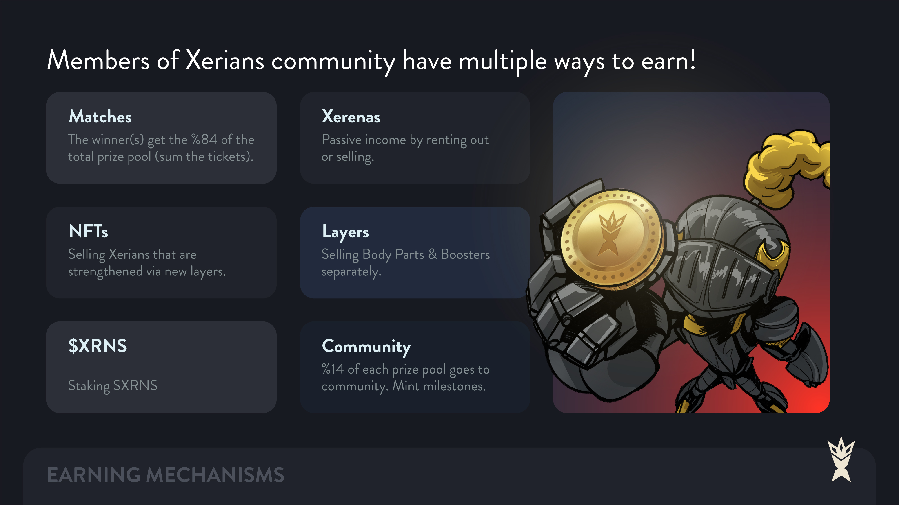

# Play to Earn

For both 1v1 and 3v3 matches, the winning team or individual gets %84 of the game revenue (sum of the battle tickets). If the match is 3v3, 3 members of the winning team share the revenue according to the Xerian card score of each one: higher scored one earns %40, second higher one earns %34 and third higher one earns %26&#x20;

Example:&#x20;

Xerns pay 500 $XRNS as the ticket price to join a 3v3 battle.

500 $XRNS \* 6 (total participants of match) = 3000 $XRNS (total revenue of battle)&#x20;

3000 $XRNS \* %84 = 2520 $XRNS (The winning team shares)&#x20;

The Highest Scored Player: 2520 $XRNS \* %40 = 1008 $XRNS&#x20;

2nd Highest Scored Player: 2520 $XRNS \* %34 = 856.8 $XRNS&#x20;

3rd Highest Scored Player: 2520 $XRNS \* %26 = 655.2 $XRNS

