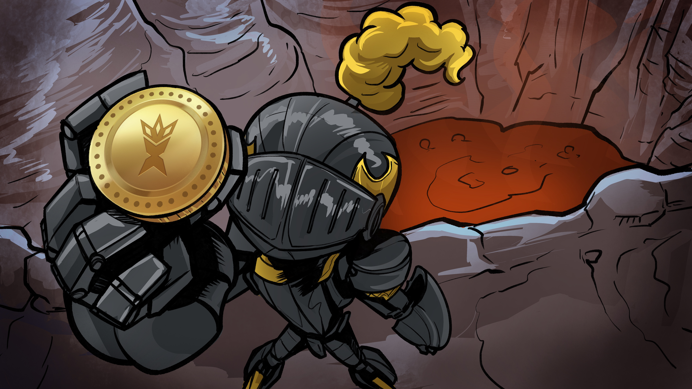

# Game Economy

Token symbol: **$XRNS**

### Usecases

**In-game Payment Method:** Xerns will use their $XRNS as the payment currency in Xerians Universe. Xerns can buy boosters, body parts and Xerenas via the in-game store.

**Xerena Passive Income:** Xerena owners can gain rent in $XRNS. Xerns need to buy a Xerena first to rent out for passive income.

**Staking:** There are different options of staking $XRNS in the game. Different stake terms and stake amounts can be chosen to gain different rewards.

**$XRNS Token farming:** Xerns can upgrade their Xerians’ skills by locking different amounts of $XRNS. This process will be present until the game release.

**NFT Investing:** $XRNS tokens can be used to invest on Xerians for battles.

**NFT Upgrades:** $XRNS tokens can be used to build and/or upgrade your Xerians.

**Rewards:** Xerns can stake their $XRNS tokens to receive random rewards such as boosters and body parts.

**Governance:** Xerns can lock $XRNS to gain voting rights for the new features and gain pre-sales rights for the future collectibles.

