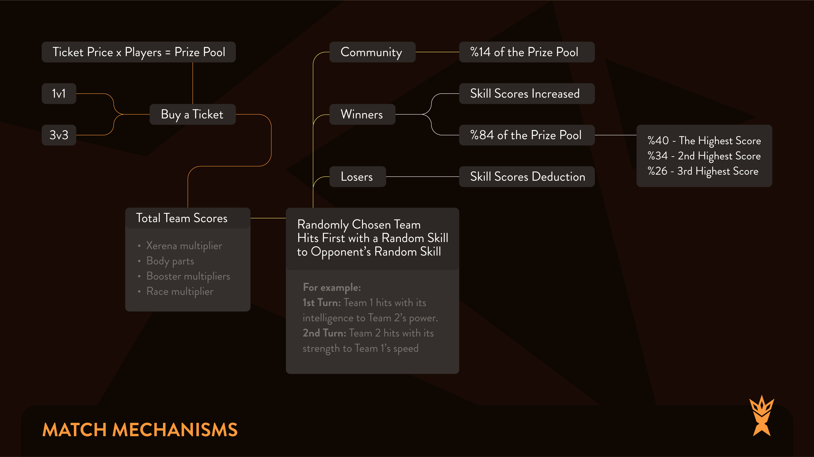

# Match Algorithm

The total score is the multiplier-applied skill scores of Xerians: the total score comes from the body parts and boosters will be multiplied according to Xerena, card type and race.

A match starts when all slots are filled. The order of players is randomly allocated; one team hits first, then the other team hits. This goes turn by turn until a team loses all of their skills scores. Both sides’ hits are based on a randomly chosen skill.

Example Flow:

In summary, the skill score of the team that makes the hit stays the same , the other team loses as many points as the score of the hitter.

When it is the turn of Team 2, the same mechanism works in the game. The team that loses the skill points loses the match.

The winning team members share the loot by its own rank based on card power.  In addition, the  winning team's card scores are increased  by 0,5 % and on contrary the same ratio of points  is deducted from the losing team’s Card scores.  &#x20;
