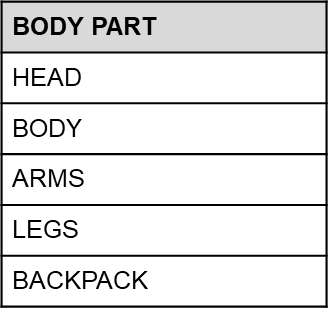

# Gameplay

Xerians has five different card colors. These colors were coded according to rarity and uniqueness levels. Each rarity will affect to score of Xerians. Cards are Heroic, Super Rare, Rare, Epic and Gold. &#x20;

.png>)

Xerians Universe has 5 different boosters and 5 different colors for each layer of your Xerians. These are;

* _Head Booster_ upgrades _Intelligence_ score of your Xerian&#x20;
* _Body Booster_ upgrades _Strength_ score of your Xerian&#x20;
* _Leg Booster_ upgrades _Speed_ score of your Xerian
* _Arm Booster_ upgrades _Power_ score of you Xerians
* _Backpack Booster_ upgrades _Strategy_ score of your Xerians

### Phase 1

Xerians Card owners will take their places in Battle Arenas where 3vs3 matches will be occurred and these arenas will be leveraged according to score and ticket prices

&#x20;

Each Xerian will be allowed to play its own score ranged room. Xerians will get a score upgrade if its team wins the battle and each Xerian will get a score downgrade if its team loses the game. With this rule each Xerian will get upgrade/downgrade and may play in high or low rated rooms.&#x20;

&#x20;

Xerian Card Owners will randomly take place into the team and eligible battle arena by buying battle tickets

&#x20;

Xerian owners will have chance to play in many rooms which has low /high rated ticket prices and get more chance to earn more.

&#x20;

When 3vs3 teams are completed, the game triggers the simulation.

&#x20;

At the Game's Simulation Part, there is "RNG" (Random Number Generator) effect on game. RNG effects to Xerians' properties while battle. This function ensures that every player can beat others irrespective of cards scores. Team working on format and will be shared with community before games begin.

&#x20;

Each Xerian Card will be upgradable and open to get higher scores. All layers of card will be replaceable with higher rated parts. All parts will be on sale in marketplace. If Xerian Card Owners replace a layer with higher scored one, they will have chance to put on sale older and lower scored one in marketplace

### Rewards for Battle

Winning team will earn %84 of game revenue. 3 teammates will share this amount according score of each one.

Higher scored one will earn %40, second higher one will earn %34 and third higher one will earn %26&#x20;

__

_Example_

Xerian Card owner chose 500 $XRNS ticket and joined the battler and their team won the battle.

500 $XRNS \* 6 = 3000 $XRNS (total revenue of battle)

3000 $XRNS \* %84 = 2520 $XRNS (Winners will share it)

&#x20;

Higher Scored Player

2520 $XRNS \* %40 = 1008 $XRNS

Second Higher Player

2520 $XRNS \* %34 = 856.8 $XRNS

Third Higher Player

2520 $XRNS \* %26 = 655.2 $XRNS

### Community Wallet & Airdrops

\*\* %14 of each match revenue will be gathered in community wallet and will be airdropped regularly to below Xerians owners in settled terms

* Each Xerian Card Owner
* Player who won most game in settled term
* Player who spent most time in settled term
* Player who played most game in settled time
* Player who upgraded most feature in settled time
* (There will be more rule sets and will be shared with community soon)

3000 $XRNS \* 0.14 (Community Wallet perc) = 420 $XRNS (Community Wallet)

&#x20;

### Staking

Xerians Owners will have chance to stake and upgrade feature of their Xerians until Game Release

#### Rules

1- Choose one of properties of your Xerian (Intelligence, Strength, Power, Speed, Strategy)

2- Choose term of staking (7 days, 15 days, 30 days, 90 days)

3- Choose speed of upgrading and make payment.  (1X = 1500 $XRNS, 2X = 3000 $XRNS, 3X = 4500 $XRNS)

&#x20;

Finalize above rules and lock your Xerian Card until staking term ends.&#x20;

Owners have chance to follow same instructions for each feature of their Xerians and get more upgrade chance.

**Don't forget!! Staking Process will end just before Game Release and there will be no chance to stake again.**

****

_Example_

You are Xerian Card Owner, and you have below Xerian Card Score separated according to properties.

1- Decide to stake your Xerian Card and choose Strategy property for staking.

2- Upgrade it faster in a short time and choose '**2X'** speed and '**7 days**' term for stake.

3- Pay 3000 $XRNS and 7 Days Upgrade Score

4- Stake your card for 7 days and upgrade your score to **8.36**

|                |         |         |          |          |          |
| -------------- | ------- | ------- | -------- | -------- | -------- |
|  Speed / $XRNS | Upgrade | Upgrade | Upgrade  | Upgrade  |          |
|                | 7 Days  | 15 Days | 30 Days  | 90 Days  | Speed Up |
| x1 / 1500      | 0,18    | 0,4     | 0,95     | 3        | X        |
| x2 / 3000      | 0,36    | 0,8     | 1,9      | 6        | 2X       |
| x3 / 4500      | 0,54    | 1,2     | 2,85     | 9        | 3X       |

_Xerian Card Stake Comparison :_

| **Propories**  | **SCORE of Xerian Card** |                 |
| -------------- | ------------------------ | --------------- |
| 
 
    | **Before Stake**         | **After Stake** |
| Inteligence    | 9                        | 9               |
| Strength       | 10                       | 10              |
| Power          | 11                       | 11              |
| Speed          | 11                       | 11              |
| Strategy       | 8                        | 8,36            |
| **Body Score** | **49**                   | **49,36**       |

### Investor Market

Xerian Owners will have chance to put their cards to Investor Market to receive offer from Investors for a limited period. Investors and Xerian Card Owners will meet in the same market and have limited agreements

.png>)

_Example_

One of Heroic Card Owner would like to play in a high rated Battle Arenas but need an Investor for it.&#x20;

One of Investors would like to join games but has no Xerians Card.&#x20;

&#x20;

Xerians Card Owner will put his/her card to Investor market and check for Investor offers for next 5/10/15 battle

Investors will need to buy an Investor Card from Investor Market to get right to be an Investor.

Investors will check for suitable card (Card score will be deterministic) for their investment&#x20;

Both sides will meet in the Investor Market and make an agreement for next limited terms. If chosen card won the battle, both side will share revenue according to percentage which is agreed on agreement

**Charity;**

After Selling out the Gen-1 Xerians, %5 of the Revenue will be donated to non-profit charity organizations on education and children. - Charity Organizations will be chosen by The Xerians Community**.**

