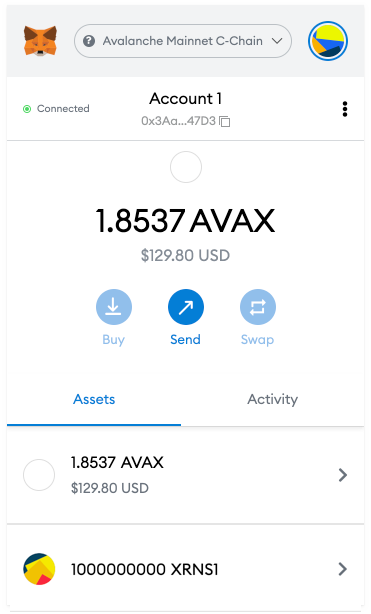

# How to connect to Metamask Wallet?

When you visit the Xerians Token Portal, a pop up window will appear to connect to and confirm your Metamask account. Please accept the request and make sure you are connected to the Avalanche Mainnet C-Chain network.&#x20;

Make sure that your connected wallet has sufficient AVAX for future operations. Your Metamask account wallet will only be used to fund gas fees of operations (i.e. Staking , Marketplace ).&#x20;

Please note, your $XRNS tokens will go to your Metamask wallet which you shared with Xerians Team and is defined in Vesting Contract so you should connect with that account to release you $XRNS tokens.&#x20;

