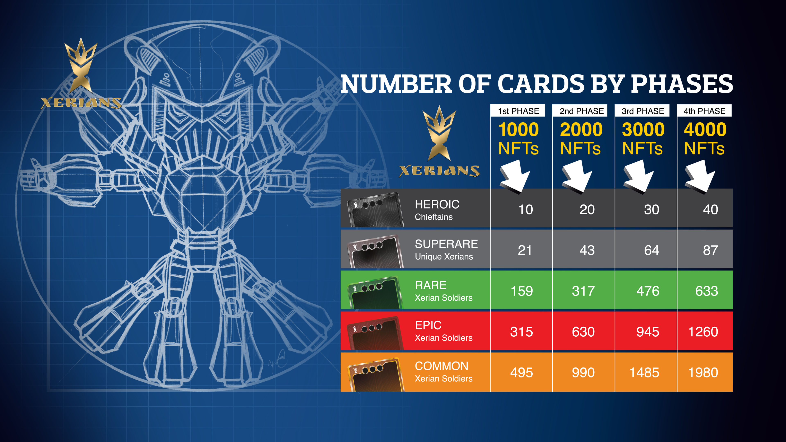

# Minting

There are 4 phases of minting. Each Xern so each wallet can mint maximum 10 NFTs per phase.

| Phases | NFTs To Be Issued | Whitelist Limit | Date            |
| ------ | ----------------- | --------------- | --------------- |
| 1      | 1000 NFTs         | 100             | 27.09.22        |
| 2      | 2000 NFTs         | 200             | To be announced |
| 3      | 3000 NFTs         | 300             | To be announced |
| 4      | 4000 NFTs         | 400             | To be announced |

Whitelisted users get priority access to buy and mint NFTs. To get whitelisted, the buyers must join [Xerians Discord Server ](https://discord.gg/RJHppHD7yB)and follow the specific instructions announced per each phase.&#x20;

Whitelisting presale process begins 4 hours  before the public sale. Limited number of  whitelisted users enjoy benefit of minting priority.

Minting price  is only 0.35 BNB + gas fee.

Minted NFTs come in a mystery box. Xerns buy and mint the mystery box without knowing the rarity and the character in it.&#x20;

&#x20;This table shows the number of cards to be minted per phase.&#x20;

<figure><figcaption></figcaption></figure>

A Xern may claim the mystery box to make the unique NFT card reveal or prefer to  keep the NFT hidden in mystery box as long as s/he wants. Mystery boxes have also the option to be sold in marketplaces to interested buyers.

