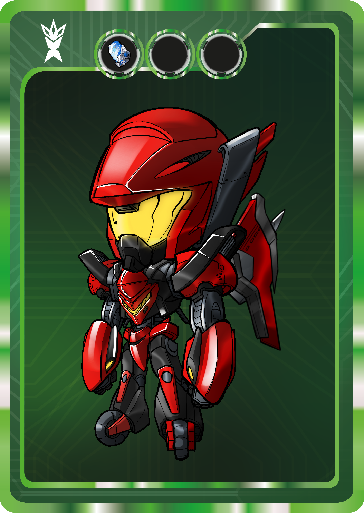
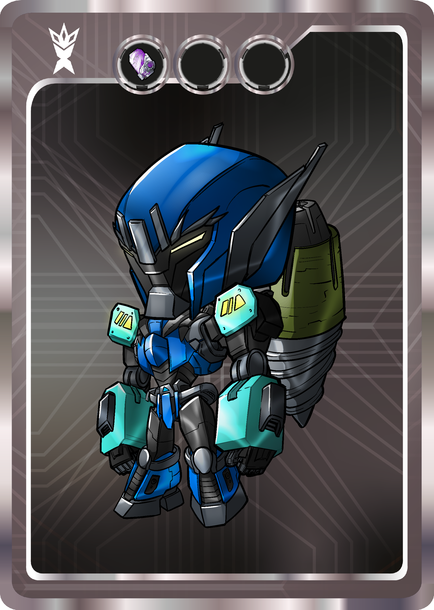

# What is Xerians?

Gen 1 Xerians has 10 Chieftains, 10 Unique Xerians and thousands of randomized generated Xerians Soldiers.

### CHIEFTAINS

Chieftains will not be separated to layers and not get in processes of randomize generating. All chieftains will be solid, and owners of Chieftains will be luckiest people in Xerians Universe. All these Chieftain NFTs will be named as Heroic. Heroics will be most powerful and highest scored NFTs when minting process end. Minters will have only 111 Heroic NFTs. Owner of Heroics will get Black Unique Card Color and a randomized booster.

### UNIQUE XERIANS

Unique Xerians will not be separated to layers and not get in processes of randomize generating. All Unique Xerians will be solid. All these Xerians NFTs will be named as Super Rare. Unique Xerians will be second most powerful and highest scored NFTs when minting process end. Minters will have only 240 Super Rare Xerians NFTs. Owners may have 4 different colors of card and one of 25 different boosters when they mint Unique Xerians.

  

### XERIAN SOLDIERS

Xerian Soldiers will be separated to 7 layers (5 of them body parts, one of them card color and last one will be booster type) and will be generated randomized. They will be named as Rare, Epic, Gold according to rarity score. Owners will have chance to get 1.760 Rare, 3.500 Epic and 5.500 Gold Xerian Soldiers when they mint.

.png.png>) 

### NFT CARD DETAIL

#### LAYERS

* Head for Intelligence&#x20;
* Body for Strength
* Arms for Power
* Legs for Speed
* BackPack for Strategy

#### RARITY & QUANTITY

* Heroic \[x111]
* SuperRare \[x240]
* Rare \[x1760]
* Epic \[x3500]
* Gold \[x5500]

#### BOOSTERS

* Head Booster&#x20;
* Body Booster&#x20;
* Arm Booster&#x20;
* Leg Booster
* BackPack Booster
